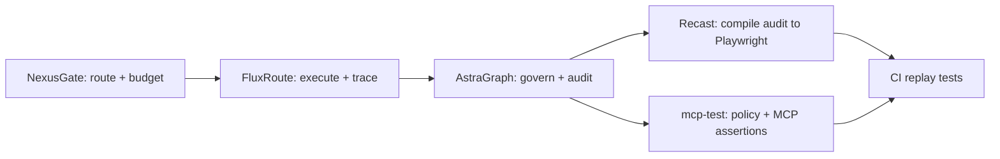

<h1 align="center">AgentStack Reference</h1>
<p align="center"><strong>Glue-only orchestration repo for the AgentStack platform loop</strong></p>

<p align="center">
  <a href="https://github.com/yagna-1/nexusgate">NexusGate</a> |
  <a href="https://github.com/yagna-1/fluxroute">FluxRoute</a> |
  <a href="https://github.com/yagna-1/astragraph">AstraGraph</a> |
  <a href="https://github.com/yagna-1/recast">Recast</a> |
  <a href="https://github.com/yagna-1/mcp-test">mcp-test</a>
</p>

<p align="center">
  
</p>

<p align="center">
  <a href="./assets/agentstack-explainer.mp4">Watch MP4 explainer</a>
</p>

<p align="center">
  <video src="./assets/agentstack-explainer.mp4" controls width="900"></video>
</p>

## What This Repo Is

`agentstack-reference` is an integration surface, not an application repo.

It contains:

- one `docker-compose.yml` that wires all five services
- one sample workflow manifest
- one sample policy bundle
- shell scripts for bootstrap, run, and audit-to-test compilation

It does not contain product business logic from NexusGate, FluxRoute, AstraGraph, Recast, or mcp-test.

## Full Loop



## Stack Mapping

| Layer | Repo | Role in this reference stack |
|---|---|---|
| Route | `nexusgate` | MCP/LLM ingress, key auth, workflow budget tracking |
| Orchestrate | `fluxroute` | deterministic workflow execution + trace capture |
| Govern | `astragraph` | policy enforcement proxy + graph/audit services |
| Test (agent) | `recast` | compile audit trails into static Playwright tests |
| Test (MCP) | `mcp-test` | policy assertion helpers and MCP contract tests |

## Quickstart

### 1. Bootstrap dependencies

```bash
./scripts/bootstrap.sh
```

This clones or updates the five source repos into `./deps/`.

### 2. Configure env

```bash
cp .env.example .env
```

### 3. Run end-to-end demo

```bash
./scripts/run.sh
```

## Demo Behavior

`run.sh` performs the following sequence:

1. starts Redis, AstraGraph services, NexusGate, and FluxRoute via Compose
2. mints a NexusGate admin token and API key
3. sends an MCP tool call through `NexusGate -> AstraGraph proxy -> mock MCP`
4. executes FluxRoute sample manifest (`safe_tool -> fail_export_data`)
5. writes AstraGraph-compatible audit JSON from FluxRoute trace export
6. compiles audit JSON into Playwright TS and Playwright Python tests using Recast

## Generated Artifacts

After a successful run, outputs are available at:

- `examples/weather-agent/output/nexusgate-mcp-response.json`
- `examples/weather-agent/output/astragraph-audit.json`
- `examples/weather-agent/output/playwright-ts/`
- `examples/weather-agent/output/playwright-py/`

## Repository Layout

```text
agentstack-reference/
├── assets/
│   ├── agentstack-explainer.gif
│   └── agentstack-explainer.mp4
├── docker-compose.yml
├── examples/
│   ├── policy/e2e-policy.yaml
│   └── weather-agent/manifest.yaml
├── scripts/
│   ├── bootstrap.sh
│   ├── run.sh
│   ├── audit_to_tests.sh
│   └── mock_mcp_server.py
└── deps/               # cloned by bootstrap.sh (gitignored)
```

## Useful Commands

```bash
# Start services manually

docker compose up -d --build

# Stop services

docker compose down

# Re-compile tests from latest audit JSON

./scripts/audit_to_tests.sh

# Run mcp-test helper test suite in tools profile

docker compose --profile tools run --rm mcp-test
```

## Notes

- This reference repo intentionally keeps integration additive and opt-in.
- The sample flow is designed to demonstrate both allowed and blocked style outcomes in generated audit/test artifacts.
- If `deps/` is missing or stale, rerun `./scripts/bootstrap.sh`.
