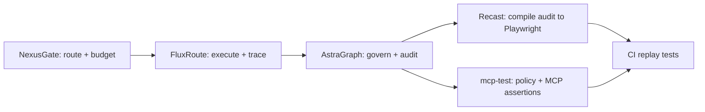

<h1 align="center">AgentStack Reference</h1>
<p align="center"><strong>Glue-only orchestration repo for the AgentStack platform loop</strong></p>

<p align="center">
  <a href="https://github.com/yagna-1/nexusgate">NexusGate</a> |
  <a href="https://github.com/yagna-1/fluxroute">FluxRoute</a> |
  <a href="https://github.com/yagna-1/astragraph">AstraGraph</a> |
  <a href="https://github.com/yagna-1/recast">Recast</a> |
  <a href="https://github.com/yagna-1/mcp-test">mcp-test</a>
</p>

<p align="center">
  
</p>

## What This Repo Is

`agentstack-reference` is an integration surface, not an application repo.

It contains:

- one `docker-compose.yml` that wires all five services
- one sample workflow manifest
- one sample policy bundle
- shell scripts for bootstrap, run, and audit-to-test compilation
- one rich CLI entrypoint (`./agentstack`) to operate the full stack from here only

It does not contain product business logic from NexusGate, FluxRoute, AstraGraph, Recast, or mcp-test.

## Full Loop



## Stack Mapping

| Layer | Repo | Role in this reference stack |
|---|---|---|
| Route | `nexusgate` | MCP/LLM ingress, key auth, workflow budget tracking |
| Orchestrate | `fluxroute` | deterministic workflow execution + trace capture |
| Govern | `astragraph` | policy enforcement proxy + graph/audit services |
| Test (agent) | `recast` | compile audit trails into static Playwright tests |
| Test (MCP) | `mcp-test` | policy assertion helpers and MCP contract tests |

## Quickstart

### 1. Bootstrap dependencies

```bash
./agentstack bootstrap
```

This clones or updates the five source repos into `./deps/`.

### 2. Configure env

```bash
cp .env.example .env
```

### 3. Run end-to-end demo

```bash
./agentstack demo
```

### 4. Operate everything from one CLI

```bash
# Launch rich terminal UI
./agentstack ui

# Health + status
./agentstack health
./agentstack ps

# Bring stack up/down
./agentstack up --build
./agentstack down

# Logs
./agentstack logs -f nexusgate

# Recompile tests from audit JSON
./agentstack compile

# Run commands inside any dependency repo
./agentstack repo nexusgate cargo check
./agentstack repo recast go test ./...
```

### Cross-Platform Launch

- macOS / Linux: `./agentstack ui`
- Windows CMD/PowerShell: `agentstack.cmd ui` or `python agentstack.py ui`
- If terminal `curses` is unavailable, the CLI auto-falls back to **Lite UI** prompt mode.
- On Windows, script-backed flows (`bootstrap`, `demo`, `compile`) use `bash`; install Git Bash (or use WSL) for full functionality.

### Rich TUI Mode

Run:

```bash
./agentstack ui
```

Theme:

- Orange-accent control center (Claude-style feel) for headers, borders, prompts, and status line.
- Health states remain semantic (`UP` green, `DOWN` red) for quick scanning.

Keybindings:

- `q` quit
- `r` refresh
- `u` compose up with build
- `d` compose down
- `b` bootstrap deps
- `m` run full demo
- `c` compile audit to tests
- `j` / `k` move selected service
- `l` toggle live log follow for selected service
- `:` open command prompt (`up`, `down`, `demo`, `compile`, `logs <service>`, `repo <name> <cmd>`, `quit`)

## Demo Behavior

`run.sh` performs the following sequence:

1. starts Redis, NexusGate, FluxRoute, and AstraGraph proxy mode via Compose
2. mints a NexusGate admin token and API key
3. sends an MCP tool call through `NexusGate -> AstraGraph proxy -> mock MCP`
4. executes FluxRoute sample manifest (`safe_tool -> fail_export_data`)
5. writes AstraGraph-compatible audit JSON from FluxRoute trace export
6. compiles audit JSON into Playwright TS and Playwright Python tests using Recast

Proxy modes:

- default: `AGENTSTACK_ASTRAGRAPH_MODE=mock` (fast local mock proxy on `:17070`)
- full: `AGENTSTACK_ASTRAGRAPH_MODE=real` (real graph/policy/verifier/proxy stack; real proxy exposed on `:17071`)

## Generated Artifacts

After a successful run, outputs are available at:

- `examples/weather-agent/output/nexusgate-mcp-response.json`
- `examples/weather-agent/output/astragraph-audit.json`
- `examples/weather-agent/output/playwright-ts/`
- `examples/weather-agent/output/playwright-py/`

## Repository Layout

```text
agentstack-reference/
├── agentstack
├── agentstack.py
├── assets/
│   ├── agentstack-explainer.gif
├── docker-compose.yml
├── examples/
│   ├── policy/e2e-policy.yaml
│   └── weather-agent/manifest.yaml
├── scripts/
│   ├── bootstrap.sh
│   ├── run.sh
│   ├── audit_to_tests.sh
│   └── mock_mcp_server.py
└── deps/               # cloned by bootstrap.sh (gitignored)
```

## Useful Commands

```bash
# Primary entrypoint
./agentstack --help
./agentstack ui

# Diagnostics
./agentstack doctor
./agentstack urls

# Full lifecycle
./agentstack bootstrap
./agentstack up --build
./agentstack health
./agentstack demo
./agentstack down
```

## Notes

- This reference repo intentionally keeps integration additive and opt-in.
- The sample flow is designed to demonstrate both allowed and blocked style outcomes in generated audit/test artifacts.
- If `deps/` is missing or stale, rerun `./agentstack bootstrap`.
- For new users, `./agentstack` is the only command surface they need.

## GitAgent Standard Overlay

This repository now includes the AgentStack GitAgent overlay:

- `agent.yaml` for identity, policy binding, and skill manifest
- `SOUL.md` for operator-facing identity and mission
- `RULES.md` for human-readable constraints mapped to runtime policy
- `memory/` for auto-committed audit/test history
- `skills/` for executable capability descriptors
- `hooks/` for pre/post execution governance automation

The overlay is additive: existing APIs and runtime behavior are unchanged unless these new files/hooks are explicitly used.
